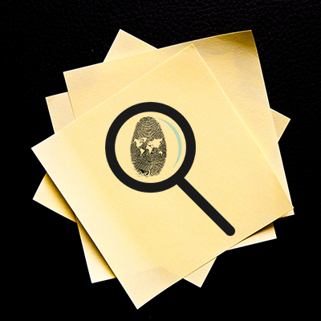
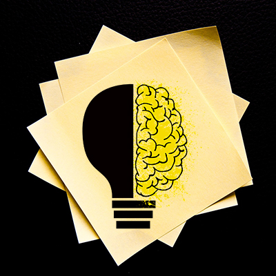
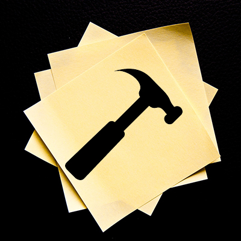

---

title: ECOSISTEMA DIGITAL
image: ./ban.jpg
banner: ./ban.jpg

---

Planeamos, diseñamos & desarrollamos la estrategia digital que necesitas, convencidos y enfocados en crear ecosistemas sustentables y escalables
te ofrecemos soluciones que marcaran la diferencia y que favorecera el crecimiento de tu marca en internet.

### El proceso de diseño que implementamos:

#### Design Thinking

¶ En nuestra metodologia de trabajo primero definimos el problema para luego implementar las posibles soluciones 
centradas en el usuario y orientadas a la accion.

---

#### 1. Conectamos con nuestros clientes

<Row>
<Col>

Primera etapa del proceso y como todo comienzo es la base del mismo.

Comenzamos reconociendo y comprendiendo las necesidades del targuet a quien va dirigido nuestro Ecosistema Digital, 
estableciendo los objetivos de investigación para identificar y unificar los deseos y las necesidades del Ecosistema a diseñar.
Las tecnicas en esta fase son la entrevista, la investigacion de la competencia, el Focus Group, entre otras, 
siempre adaptados a las circunstancias del momento.

</Col>
<Col>

</Col>
</Row>

---

#### 2.  Definimos el Problema

<Row>
<Col>

</Col>
<Col>

En esta etapa organizamos, identificamos y filtramos la informacion recopilada durante la etapa anterior.

Identificamos lo que aporta valor, las areas de oportunidades, las soluciones relevantes que podemos ofrecer y las necesidades para los usuarios del Ecosistema.

Esta es la etapa que pone a pruba la capacidad de los individuos que forman parte del proyecto para trabajar en equipo aportando su singularidad.

</Col>

</Row>

---

#### 3. Ideamos

<Row>
<Col>

En esta etapa tu te relajas y nuestro equipo se empapa en una lluvia de ideas que provienen de
pensamientos expansivos y que no tiene límites a la 
hora de generar insights y las soluciones mas innovadoras.

</Col>
<Col>

</Col>
</Row>

---

#### 4. Prototipamos

<Row>
<Col>

</Col>
<Col>

En esta etapa construimos prototipos a partir de las ideas generadas haciendolas realidad con 
el objetivo de ayudar a visualizar las posibles soluciones que podremos mostrar al usuario, 
quien podra darnos el feedback una vez decida la solucion que mejor se ajusta a sus deseos y necesidades.

Conectamos la idea con el producto poniendo de manifiesto en una rapida accion la solucion adecuada.

</Col>

</Row>

---

#### 5. Testeamos

<Row>
<Col>

En esta etapa probamos el prototipo con la ayuda del targuet objetivo hacia el que se orienta el Ecosistema Digital. 
Ellos nos ayudaran a identificar mejoras significativas, fallos a resolver, profundizar la empatia, 
re-definir posibles problemas, entre otros.

Evolucionamos nuestra idea hasta concluirla en la solucion que se buscaba.

</Col>
<Col>

</Col>
</Row>

---

## QUE ESTAS ESPERANDO

Se hace muy simple con <cite>— [WEBCOM.WEBSITE](http://webcom.website/)</cite>

>  Mejoramos la visibilidad de tu Ecosistema Digital, ya que utilizamos diferentes tecnicas de marketing onLine tales como SEO ,SEM, social media, inbound, contenido de calidad y relevancia & emailing. Trabajamos con nuestra metodologia única porque fue estructurada por nuestro equipo con base en las ciencias informaticas y sociologicas y que nos permiten entender junto a vos el objetivo que se desea lograr  

---

### SEGUINOS EN NUESTRAS REDES & +