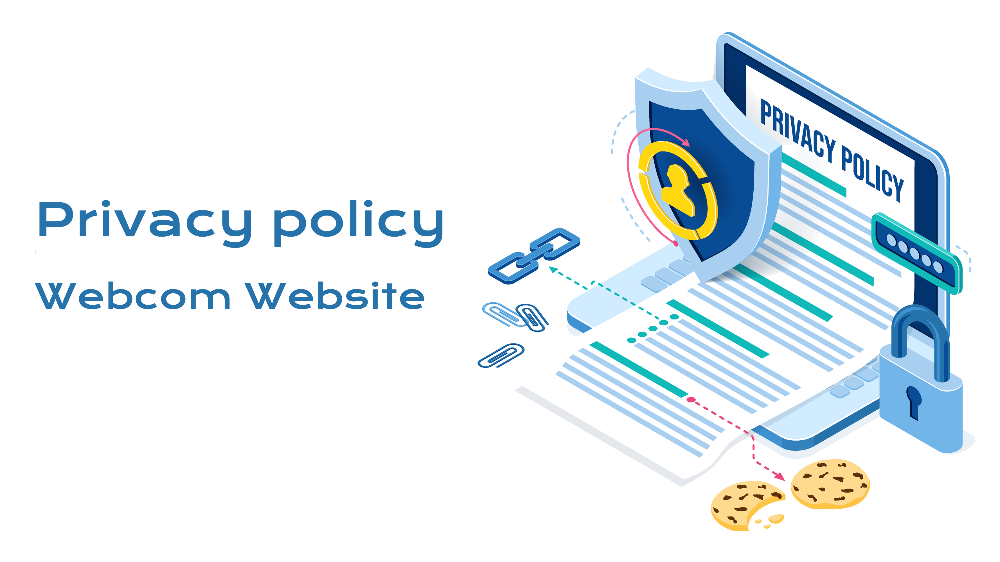

# Cookies 

---

Las cookies son pequeños fragmentos de texto que se utilizan para almacenar información en los navegadores web. Permiten almacenar y recibir identificadores e información adicional en ordenadores, teléfonos y otros dispositivos. Otras tecnologías, incluidos datos que almacenamos en tu navegador web o dispositivo, identificadores asociados a tu dispositivo y otro software, se utilizan con fines similares. A efectos de esta política, todas estas tecnologías reciben el nombre de “cookies”.
 Las cookies permiten a Facebook ofrecerte sus productos y nos ayudan a comprender la información que recibimos de ti.
 Las cookies nos ayudan a proporcionar, proteger y mejorar los productos de Webcom Website

 ---

 # ¿Dónde utilizamos las cookies?

 ---

 Podemos almacenar cookies en tu ordenador o dispositivo, y recibir información almacenada en ellas cuando utilices o visites:

los productos de Webcom Website.

Al aceptar las Condiciones Generales de uso de nuestras paginas 
das tu consentimiento a dicho uso de cookies. Dicho consentimiento se
podrá revocar en cualquier momento desde las preferencias de su navegador
bloqueándolas o bien borrándolas.

Puedes encontrar más información sobre las cookies en

<a href="www.allaboutcookies.org."> <u> todo sobre las cookies </u> </a>

---

|| Fecha de la última revisión: 27 de noviembre de 2020

---
---

### || GRACIAS POR ESTAR AQUÍ.
#### QUE TENGAS UN MAGESTUOSO DÍA. 
