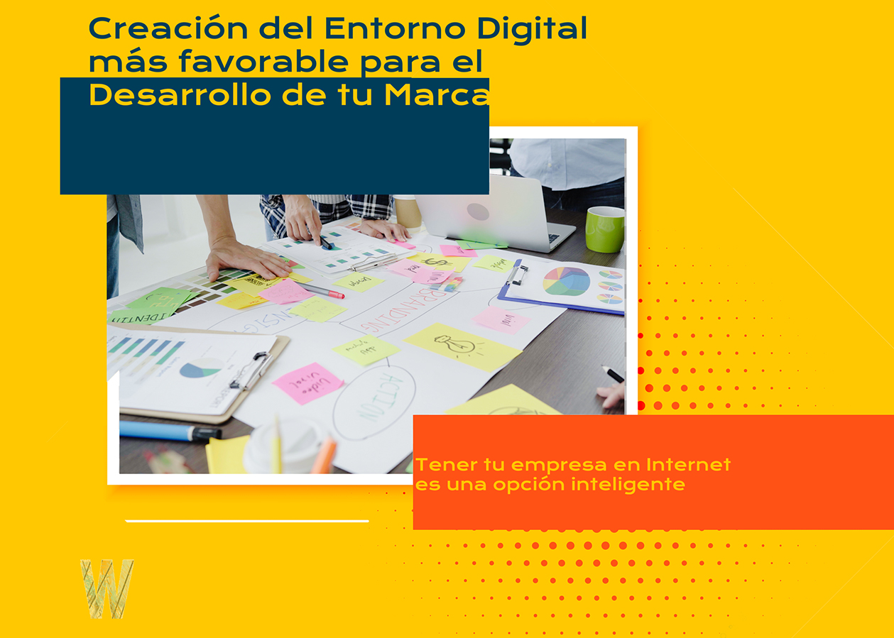
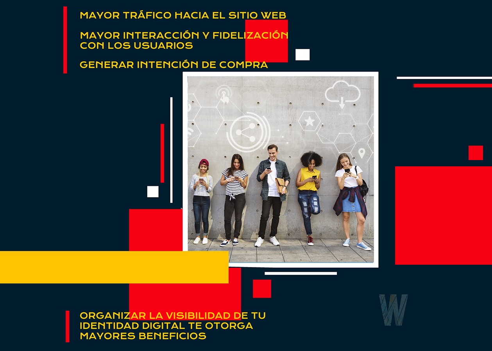
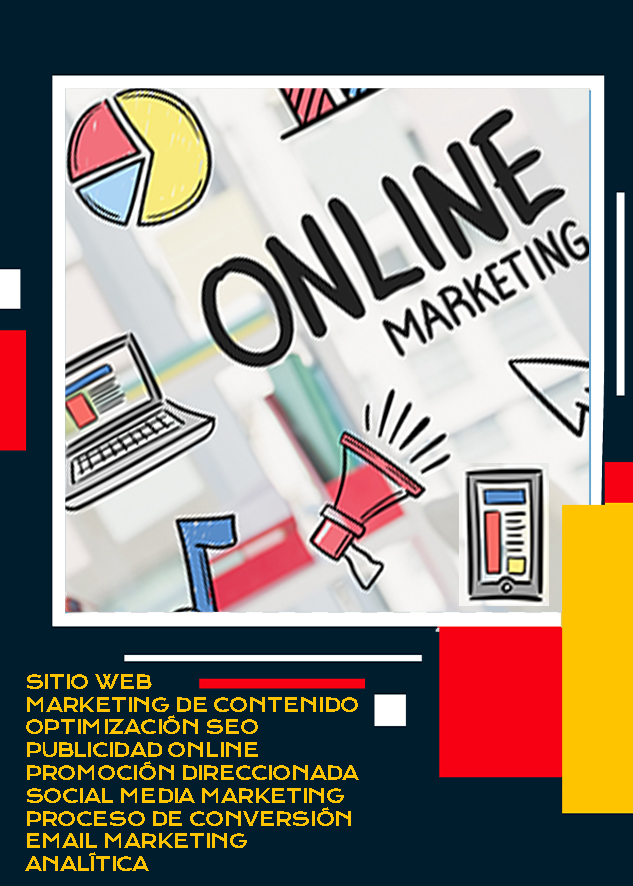
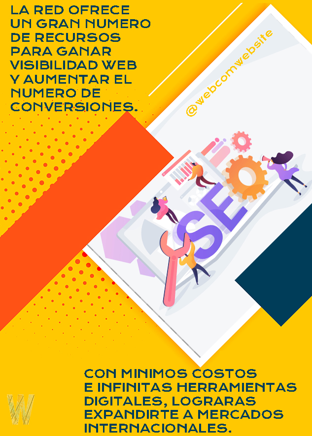

<Row>
<Col>

||

QUÉ ES EL ECOSISTEMA DIGITAL

||

---

</Col>
<Col>

||

OBJETIVOS DEL ECOSISTEMA DIGITAL

||

---

</Col>
</Row>

<Row>
<Col>

||

ELEMENTOS DEL ECOSISTEMA DIGITAL

||

---

</Col>
<Col>

||

BENEFICIOS DEL ECOSISTEMA DIGITAL

||

---

</Col>
</Row>

---

#### Te Recordamos que en WEBCOM

---

<Row>
<Col>

 Diseñamos la identidad de la marca y la vinculación a las redes sociales de interés,
posicionamos orgánicamente tu sitio web en Google para lograr mayor tráfico,
generamos campañas de publicidad en Google Ads y Redes Sociales. 
Conectamos la idea con el producto poniendo de manifiesto en una rápida acción la solución adecuada.

###### Gestionamos la cadena de suministros que necesitas para iniciar e implementar el empoderamiento de tu marca.

</Col>

</Row>